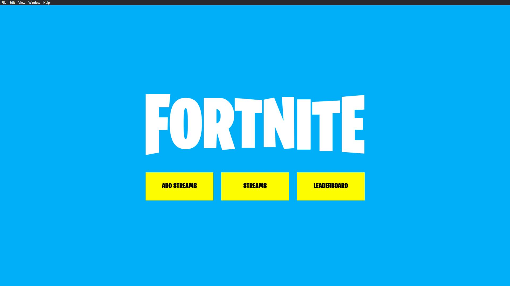
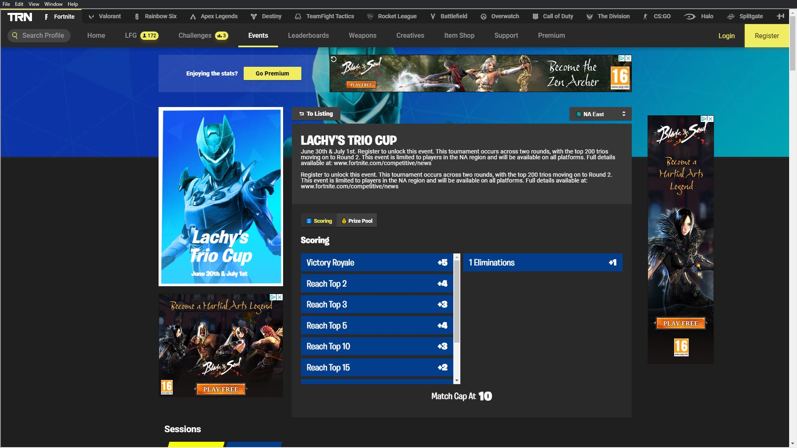
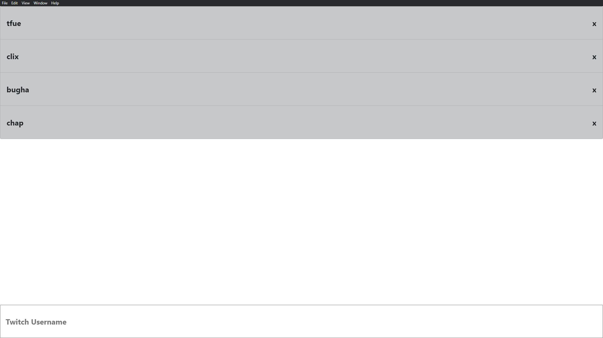

# fortnite-competitive-tv

A Desktop Application to watch competivive Fortnite matches along with a live leaderboard.

## Documentation

The documentation for fortnite-competitive-tv can be viewed [here]().

## Technology Stack

### Client

    

### Development

  

## Application

|  |  |  |
| --------------------------------- | :----------------------------------: | ---------------------------------------- |

## License

MIT
